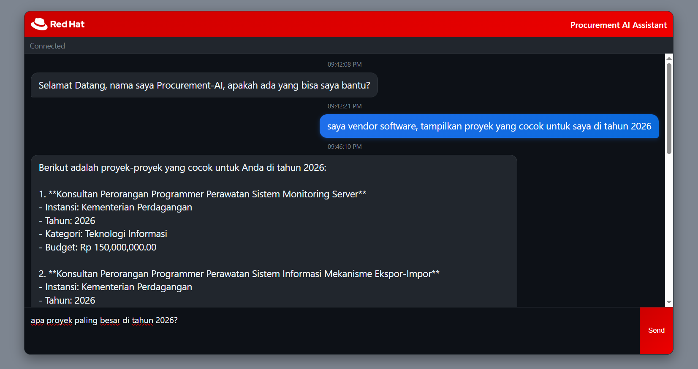

# Quarkus Procurement AI

A Quarkus-based AI-powered procurement assistant for Indonesian government procurement data (RUP - Rencana Umum Pengadaan). This application uses RAG (Retrieval Augmented Generation) with vector embeddings to provide intelligent answers about procurement records in Bahasa Indonesia.

## Features

- 🤖 **AI-Powered Chat**: Ask questions about procurement data in natural language
- 🔍 **Vector Search**: Semantic search through procurement records using embeddings
- 🇮🇩 **Indonesian Language Support**: Responds in Bahasa Indonesia
- 📊 **RUP Database Integration**: Works with Indonesian government procurement data
- 🛠️ **Database Tools**: AI can execute SQL queries and retrieve institution/category lists
- 🎯 **Smart Retrieval**: RAG with configurable similarity scoring (minScore: 0.3, maxResults: 10)
- 🚀 **High Performance**: Built on Quarkus for fast startup and low memory usage
- 🐘 **PostgreSQL + pgvector**: Efficient vector storage and retrieval

## Technologies Used

- **Framework**: Quarkus 3.15.1
- **Language**: Java 21
- **AI/ML**: LangChain4J 0.21.0
- **LLM**: Ollama (Qwen2.5:7b for chat, bge-m3 for embeddings)
- **Database**: PostgreSQL with pgvector extension
- **ORM**: Hibernate ORM with Panache
- **API**: JAX-RS with Jackson
- **Build Tool**: Maven

## Prerequisites

Before running this application, ensure you have:

1. **Java 21** or later
2. **Maven 3.8+**
3. **PostgreSQL** with **pgvector** extension
4. **Ollama** with required models:
   - `qwen2.5:7b` (for chat)
   - `bge-m3` (for embeddings)

## Setup Instructions

### 1. Database Setup

Create a PostgreSQL database with pgvector extension:

```sql
CREATE DATABASE procurement;
\c procurement;
CREATE EXTENSION vector;
```

### 2. Ollama Setup

Install and start Ollama, then pull the required models:

```bash
# Install Ollama (visit https://ollama.ai for installation instructions)

# Pull required models
ollama pull qwen2.5:7b
ollama pull bge-m3
```

### 3. Application Configuration

Update `src/main/resources/application.properties` with your database credentials:

```properties
# Database connection
quarkus.datasource.db-kind=postgresql
quarkus.datasource.username=dev
quarkus.datasource.password=dev123
quarkus.datasource.jdbc.url=jdbc:postgresql://192.168.8.140:5432/procurement

# Ollama Chat Config (Qwen)
quarkus.langchain4j.ollama.chat-model.model-id=qwen2.5:7b
quarkus.langchain4j.ollama.base-url=http://192.168.8.140:11434
quarkus.langchain4j.ollama.timeout=180s
quarkus.langchain4j.ollama.embedding-model.model-id=bge-m3
quarkus.langchain4j.ollama.chat-model.temperature=0.0

# PGVector Store Setup
quarkus.langchain4j.pgvector.table=procurement_embeddings
quarkus.langchain4j.pgvector.dimension=1024

# Logging Configuration
quarkus.log.level=INFO
quarkus.log.category."com.edw".level=DEBUG
```

### 4. Build and Run

```bash
# Build the application
./mvnw clean compile quarkus:dev

# Or run in production mode
./mvnw clean package
java -jar target/quarkus-app/quarkus-run.jar
```

## Web User Interface

The application includes a modern, responsive web-based chat interface that provides an intuitive way to interact with the Procurement AI Assistant.

### UI Features

- 🎨 **Modern Design**: Clean, dark-themed interface with Red Hat branding
- 💬 **Real-time Chat**: WebSocket-based communication for instant responses
- ⚡ **Responsive**: Works seamlessly on desktop and mobile devices
- 🕒 **Timestamps**: Each message includes precise timing information
- 🔄 **Loading Indicators**: Visual feedback during message processing
- ⌨️ **Keyboard Shortcuts**: Ctrl+Enter to send messages, Enter for new lines
- 🔗 **Connection Status**: Real-time connection status monitoring

### Accessing the Web UI

Once the application is running, open your web browser and navigate to:

```
http://localhost:8080
```

The interface will automatically connect to the backend and display the connection status. You can then start asking questions about procurement data in natural language.



*Screenshot showing the web-based chat interface with Red Hat branding and real-time messaging capabilities.*

### Usage Tips

- Use **Ctrl+Enter** to send messages quickly
- The interface supports multi-line input - press **Enter** for new lines
- Connection status is displayed at the top of the chat window
- Messages include timestamps for reference
- The interface automatically scrolls to show the latest messages

## API Documentation

### Chat Endpoint

Ask questions about procurement data:

**POST** `/procurement/chat`

```bash
curl -X POST http://localhost:8080/procurement/chat \
  -H "Content-Type: application/json" \
  -d "Apa saja proyek catering di DKI Jakarta untuk tahun 2026?"
```

**Response:**
```
Berikut adalah proyek-proyek catering di DKI Jakarta untuk tahun 2026:

1. Penyediaan Makanan dan Minuman dengan budget Rp55,100,000.00 (Kode Proyek: 61726429)
2. Penyediaan Makanan dan Minuman Tamu dengan budget Rp6,500,000.00 (Kode Proyek: 61811379)
3. Penyediaan Makanan dan Minuman Tamu dengan budget Rp29,250,000.00 (Kode Proyek: 61806754)
4. Penyediaan Makanan dan Minuman Rapat Koordinasi dengan budget Rp55,100,000.00 (Kode Proyek: 61726429)
5. Penyediaan Makanan dan Minuman Pelayanan Bina Kependudukan (Biduk) dengan budget Rp16,250,000.00 (Kode Proyek: 61800854)

Semua proyek tersebut memiliki kategori Konsumsi & Catering dan instansi Provinsi DKI Jakarta. 
```

### Data Ingestion Endpoint

Process and embed procurement records:

**POST** `/procurement/ingest?limit={number}`

```bash
curl -X POST "http://localhost:8080/procurement/ingest?limit=100"
```

This endpoint processes unembedded procurement records and creates vector embeddings for semantic search.

## Data Model

The application works with procurement records containing:

- **idRup**: Unique RUP identifier
- **title**: Procurement title/description
- **budget**: Procurement budget
- **year**: Procurement year
- **institution**: Government institution details
- **category**: Procurement category (see supported categories below)
- **embedded**: Flag indicating if record has been vectorized

### Supported Procurement Categories

The system supports the following procurement categories:
- **ATK & Perlengkapan Kantor** - Office supplies and equipment
- **Alat Kesehatan & Farmasi** - Medical equipment and pharmaceuticals
- **Teknologi Informasi** - Information technology
- **Konstruksi & Infrastruktur** - Construction and infrastructure
- **Jasa Konsultansi** - Consulting services
- **Konsumsi & Catering** - Food and catering services
- **Pelatihan & Pendidikan** - Training and education
- **Kendaraan** - Vehicles

## Usage Examples

### 1. Ask about specific procurement items
```bash
curl -X POST http://localhost:8080/procurement/chat \
  -H "Content-Type: application/json" \
  -d "Apa saja proyek di pemprov DKI Jakarta untuk tahun 2026?"
```

### 2. Query budget information
```bash
curl -X POST http://localhost:8080/procurement/chat \
  -H "Content-Type: application/json" \
  -d "berapa total anggaran pengadaan catering di DKI Jakarta untuk tahun 2026?"
```

### 3. Ingest new data
```bash
curl -X POST "http://localhost:8080/procurement/ingest?limit=50"
```

## Development

### Running in Development Mode

```bash
./mvnw compile quarkus:dev
```

This enables hot reload for faster development.

### Health Check

The application includes health checks available at:
- http://localhost:8080/q/health

## Architecture

```
┌─────────────────┐    ┌──────────────────┐    ┌─────────────────┐
│   REST Client   │───▶│  ChatResource    │───▶│ ProcurementAI   │
└─────────────────┘    └──────────────────┘    └─────────────────┘
                                │                        │
                                ▼                        ▼
                       ┌──────────────────┐    ┌─────────────────┐
                       │ EmbeddingService │    │     Ollama      │
                       └──────────────────┘    │  (Qwen2.5:7b)   │
                                │              └─────────────────┘
                                ▼                        │
                       ┌──────────────────┐              │
                       │   PostgreSQL     │◀─────────────┘
                       │   + pgvector     │    DatabaseTool
                       │ (embeddings +    │   (SQL queries)
                       │  source data)    │
                       └──────────────────┘
```

### AI Assistant Capabilities

The AI assistant leverages multiple tools for comprehensive procurement analysis:

- **Vector Search (RAG)**: Semantic search through embedded procurement records
- **Database Queries**: Direct SQL execution on procurement_record table
- **Institution Lookup**: Retrieve all available government institutions
- **Category Lookup**: Get list of all procurement categories
- **Year Lookup**: Access available procurement years
- **Smart Filtering**: Automatic filtering for embedded records only

## Table Structure
```sql
CREATE TABLE public.procurement_record (
    id bigint NOT NULL,
    id_rup character varying(20),
    title text,
    budget numeric(20,2),
    year integer,
    id_satker character varying(10),
    satker_name character varying(250),
    id_klpd character varying(5),
    institution character varying(250),
    klpd_type character varying(14),
    category character varying(128),
    embedded boolean DEFAULT false,
    created_at timestamp without time zone DEFAULT now()
);
INSERT INTO public.procurement_record (id, id_rup, title, budget, year, id_satker, satker_name, id_klpd, institution, klpd_type, category, embedded, created_at) VALUES (12300, '60522829', 'Penyediaan Pendidik dan Tenaga Kependidikan bagi Satuan Pendidikan Khusus', 1461961460.00, 2026, '144073', 'SUKU DINAS PENDIDIKAN WILAYAH 1 KOTA - JAKUT', 'D69', 'Provinsi DKI Jakarta', 'PROVINSI', 'Lainnya', true, '2026-04-29 11:08:02.67684');
INSERT INTO public.procurement_record (id, id_rup, title, budget, year, id_satker, satker_name, id_klpd, institution, klpd_type, category, embedded, created_at) VALUES (12301, '60522830', 'Penyediaan Pendidik dan Tenaga Kependidikan bagi Satuan Pendidikan Sekolah Dasar', 31724563682.00, 2026, '144073', 'SUKU DINAS PENDIDIKAN WILAYAH 1 KOTA - JAKUT', 'D69', 'Provinsi DKI Jakarta', 'PROVINSI', 'Lainnya', true, '2026-04-29 11:08:02.67684');
INSERT INTO public.procurement_record (id, id_rup, title, budget, year, id_satker, satker_name, id_klpd, institution, klpd_type, category, embedded, created_at) VALUES (12302, '60522831', 'Penyediaan Pendidik dan Tenaga Kependidikan bagi Satuan Pendidikan Sekolah Menengah Pertama', 18201420177.00, 2026, '144073', 'SUKU DINAS PENDIDIKAN WILAYAH 1 KOTA - JAKUT', 'D69', 'Provinsi DKI Jakarta', 'PROVINSI', 'Lainnya', true, '2026-04-29 11:08:02.67684');
INSERT INTO public.procurement_record (id, id_rup, title, budget, year, id_satker, satker_name, id_klpd, institution, klpd_type, category, embedded, created_at) VALUES (12303, '60522832', 'Penyediaan Pendidik dan Tenaga Kependidikan bagi Satuan PAUD', 2412236409.00, 2026, '144073', 'SUKU DINAS PENDIDIKAN WILAYAH 1 KOTA - JAKUT', 'D69', 'Provinsi DKI Jakarta', 'PROVINSI', 'Lainnya', true, '2026-04-29 11:08:02.67684');
INSERT INTO public.procurement_record (id, id_rup, title, budget, year, id_satker, satker_name, id_klpd, institution, klpd_type, category, embedded, created_at) VALUES (12304, '60522833', 'Penyediaan Pendidik dan Tenaga Kependidikan bagi Satuan Pendidikan Nonformal/Kesetaraan', 2485334482.00, 2026, '144073', 'SUKU DINAS PENDIDIKAN WILAYAH 1 KOTA - JAKUT', 'D69', 'Provinsi DKI Jakarta', 'PROVINSI', 'Lainnya', true, '2026-04-29 11:08:02.67684');
INSERT INTO public.procurement_record (id, id_rup, title, budget, year, id_satker, satker_name, id_klpd, institution, klpd_type, category, embedded, created_at) VALUES (12305, '60595988', 'Jasa Konsultansi Survei Harga Untuk Penyusunan Standar Harga Satuan', 1559880000.00, 2026, '182173', 'UNIT PENGELOLA MANAJEMEN STANDAR BELANJA', 'D69', 'Provinsi DKI Jakarta', 'PROVINSI', 'Jasa Konsultansi', true, '2026-04-29 11:08:02.67684');
INSERT INTO public.procurement_record (id, id_rup, title, budget, year, id_satker, satker_name, id_klpd, institution, klpd_type, category, embedded, created_at) VALUES (12306, '60680948', 'Sewa Bandwidth', 1163717386.00, 2026, '162970', 'SUKU DINAS KOMUNIKASI, INFORMATIKA DAN STATISTIK KABUPATEN - KEP.SERIBU', 'D69', 'Provinsi DKI Jakarta', 'PROVINSI', 'Lainnya', true, '2026-04-29 11:08:02.67684');
INSERT INTO public.procurement_record (id, id_rup, title, budget, year, id_satker, satker_name, id_klpd, institution, klpd_type, category, embedded, created_at) VALUES (12307, '60681103', 'Sewa Mesin Fotocopy', 37214016.00, 2026, '162970', 'SUKU DINAS KOMUNIKASI, INFORMATIKA DAN STATISTIK KABUPATEN - KEP.SERIBU', 'D69', 'Provinsi DKI Jakarta', 'PROVINSI', 'Lainnya', true, '2026-04-29 11:08:02.67684');
INSERT INTO public.procurement_record (id, id_rup, title, budget, year, id_satker, satker_name, id_klpd, institution, klpd_type, category, embedded, created_at) VALUES (12308, '60768572', 'Belanja Jasa Konsultansi Berorientasi Bidang-Keuangan (BAKD)', 600000000.00, 2026, '305704', 'BADAN PENGELOLA KEUANGAN DAN ASET', 'D63', 'Provinsi DI Yogyakarta', 'PROVINSI', 'Jasa Konsultansi', true, '2026-04-29 11:08:02.67684');
INSERT INTO public.procurement_record (id, id_rup, title, budget, year, id_satker, satker_name, id_klpd, institution, klpd_type, category, embedded, created_at) VALUES (12309, '61048312', 'Pengadaan Tenaga Pengamanan (SATPAM) Januari Tahun 2026', 539487000.00, 2026, '6880', 'RSU DR KARIADI SEMARANG', 'K9', 'Kementerian Kesehatan', 'KEMENTERIAN', 'Lainnya', true, '2026-04-29 11:08:02.67684');
INSERT INTO public.procurement_record (id, id_rup, title, budget, year, id_satker, satker_name, id_klpd, institution, klpd_type, category, embedded, created_at) VALUES (12310, '61050730', 'Pengadaan Tenaga Housekeeping Kelompok Instalasi Eksekutif  Januari Tahun 2026', 568955000.00, 2026, '6880', 'RSU DR KARIADI SEMARANG', 'K9', 'Kementerian Kesehatan', 'KEMENTERIAN', 'Lainnya', true, '2026-04-29 11:08:02.67684');
INSERT INTO public.procurement_record (id, id_rup, title, budget, year, id_satker, satker_name, id_klpd, institution, klpd_type, category, embedded, created_at) VALUES (12311, '61050959', 'Pengadaan Tenaga Housekeeping Kelompok Instalasi Rawat Inap Kelas 1, 2 dan Holding Area Januari Tahun 2026', 519627000.00, 2026, '6880', 'RSU DR KARIADI SEMARANG', 'K9', 'Kementerian Kesehatan', 'KEMENTERIAN', 'Lainnya', true, '2026-04-29 11:08:02.67684');

```

## Contributing

1. Fork the repository
2. Create a feature branch
3. Make your changes
4. Add tests if applicable
5. Submit a pull request

## License

This project is licensed under the MIT License.

## Author

Muhammad Edwin <edwin at redhat dot com>

---

For more information about Quarkus, visit: https://quarkus.io
