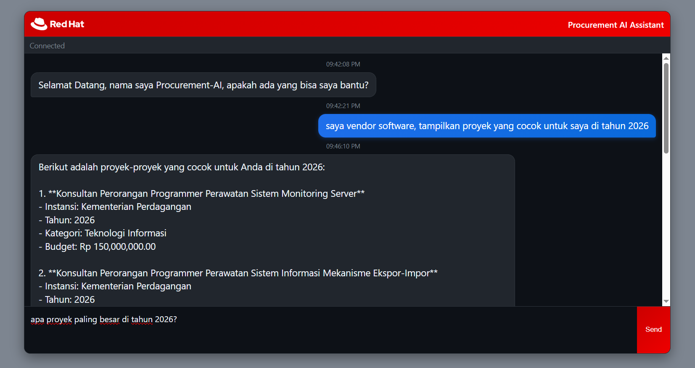

# Quarkus Procurement AI

A Quarkus-based AI-powered procurement assistant for Indonesian government procurement data (RUP - Rencana Umum Pengadaan). This application uses RAG (Retrieval Augmented Generation) with vector embeddings to provide intelligent answers about procurement records in Bahasa Indonesia.

## Features

- 🤖 **AI-Powered Chat**: Ask questions about procurement data in natural language
- 🔍 **Vector Search**: Semantic search through procurement records using embeddings
- 🇮🇩 **Indonesian Language Support**: Responds in Bahasa Indonesia
- 📊 **RUP Database Integration**: Works with Indonesian government procurement data
- 🛠️ **Database Tools**: AI can execute SQL queries and retrieve institution/category lists
- 🎯 **Smart Retrieval**: RAG with configurable similarity scoring (minScore: 0.3, maxResults: 10)
- 📄 **Document Processing**: PDF document ingestion and processing using Docling service
- 🛡️ **Security Guardrails**: Input validation and SQL injection protection
- 💭 **Chat Memory**: Conversation context management with configurable memory windows
- 🚀 **High Performance**: Built on Quarkus for fast startup and low memory usage
- 🚀 **Infinispan Vector Store**: High-performance in-memory vector storage and retrieval

## Technologies Used

- **Framework**: Quarkus 3.34.6
- **Language**: Java 21
- **AI/ML**: LangChain4J 1.9.1
- **LLM**: Ollama (Qwen2.5:7b for chat, bge-m3 for embeddings)
- **Document Processing**: Docling 1.3.1 for PDF processing and conversion
- **Vector Store**: Infinispan for embeddings storage and retrieval
- **Database**: PostgreSQL for structured data
- **ORM**: Hibernate ORM with Panache
- **API**: JAX-RS with Jackson, WebSocket for real-time chat
- **Build Tool**: Maven

## Prerequisites

Before running this application, ensure you have:

1. **Java 21** or later
2. **Maven 3.8+**
3. **PostgreSQL** (for structured procurement data)
4. **Infinispan Server** (for vector embeddings storage)
5. **Ollama** with required models:
   - `qwen2.5:7b` (for chat)
   - `bge-m3` (for embeddings)
6. **Docling Service** (for PDF document processing)

## Setup Instructions

### 1. Database Setup

Create a PostgreSQL database for structured data:

```sql
CREATE DATABASE procurement;
```

### 2. Infinispan Server Setup

Install and start Infinispan Server for vector embeddings storage:

```bash
# Download Infinispan Server from https://infinispan.org/download/
# Extract and start the server
bin/server.sh

# Or using Docker:
docker run -it -p 11222:11222 -e USER="admin" -e PASS="password" quay.io/infinispan/server:15.0
```

### 3. Ollama Setup

Install and start Ollama, then pull the required models:

```bash
# Install Ollama (visit https://ollama.ai for installation instructions)

# Pull required models
ollama pull qwen2.5:7b
ollama pull bge-m3
```

### 4. Docling Service Setup

Install and start the Docling service for PDF document processing:

```bash
# Using Docker
docker run -d --name docling-service -p 5001:5001 ds4sd/docling-serve:latest

# Or install on Kubernetes
```yaml
kind: Deployment
apiVersion: apps/v1
metadata:
  name: docling
  namespace: llm
spec:
  replicas: 1
  selector:
    matchLabels:
      app: docling
  template:
    metadata:
      creationTimestamp: null
      labels:
        app: docling
    spec:
      containers:
        - name: docling
          image: quay.io/docling-project/docling-serve
          ports:
            - containerPort: 5001
              protocol: TCP
          resources:
            limits:
              cpu: '2'
              memory: 4Gi
            requests:
              cpu: 500m
              memory: 2Gi
          terminationMessagePath: /dev/termination-log
          terminationMessagePolicy: File
          imagePullPolicy: Always
      restartPolicy: Always
      terminationGracePeriodSeconds: 30
      dnsPolicy: ClusterFirst
      securityContext: {}
      schedulerName: default-scheduler
  strategy:
    type: RollingUpdate
    rollingUpdate:
      maxUnavailable: 25%
      maxSurge: 25%
  revisionHistoryLimit: 10
  progressDeadlineSeconds: 600
```

### 5. Application Configuration

Update `src/main/resources/application.properties` with your database, Infinispan, and service credentials:

```properties
# Database connection
quarkus.datasource.db-kind=postgresql
quarkus.datasource.username=dev
quarkus.datasource.password=dev123
quarkus.datasource.jdbc.url=jdbc:postgresql://192.168.8.140:5432/procurement
quarkus.hibernate-orm.database.version-check.enabled=false

# Ollama Chat Config (Qwen)
quarkus.langchain4j.ollama.chat-model.model-id=qwen2.5:7b
quarkus.langchain4j.ollama.base-url=http://192.168.8.140:11434
quarkus.langchain4j.ollama.timeout=360s
quarkus.langchain4j.ollama.embedding-model.model-id=bge-m3
quarkus.langchain4j.ollama.chat-model.temperature=0.0

# Infinispan Store Setup
quarkus.langchain4j.infinispan.cache-name=procurement_embeddings
quarkus.langchain4j.infinispan.dimension=1024
quarkus.langchain4j.infinispan.create-cache=true
quarkus.langchain4j.infinispan.cache-config=<?xml version=\"1.0\"?><distributed-cache name=\"procurement_embeddings\" mode=\"SYNC\"><persistence><file-store><data path=\"/opt/infinispan/server/data\"/></file-store></persistence><indexing enabled=\"true\" storage=\"local-heap\"><index-reader/><indexed-entities><indexed-entity>LangchainItem1024</indexed-entity></indexed-entities></indexing></distributed-cache>

# Infinispan Client Configuration
quarkus.infinispan-client.hosts=192.168.8.140:11222
quarkus.infinispan-client.username=admin
quarkus.infinispan-client.password=password
quarkus.infinispan-client.client-intelligence=BASIC

# Docling Service Configuration
quarkus.docling.devservices.enabled=false
quarkus.docling.base-url=http://192.168.8.140:5001

# Chat Memory Configuration
quarkus.langchain4j.chat-memory.memory-window.max-messages=10
quarkus.langchain4j.chat-memory.token-window.max-tokens=1000

# Logging Configuration
quarkus.log.level=INFO
quarkus.log.category."com.edw".level=DEBUG

# WebSocket Configuration
quarkus.websockets-next.server.supported-subprotocols=chat
```

### 6. Build and Run

```bash
# Build the application
./mvnw clean compile quarkus:dev

# Or run in production mode
./mvnw clean package
java -jar target/quarkus-app/quarkus-run.jar
```

## Web User Interface

The application includes a modern, responsive web-based chat interface that provides an intuitive way to interact with the Procurement AI Assistant.

### UI Features

- 🎨 **Modern Design**: Clean, dark-themed interface with Red Hat branding
- 💬 **Real-time Chat**: WebSocket-based communication for instant responses
- ⚡ **Responsive**: Works seamlessly on desktop and mobile devices
- 🕒 **Timestamps**: Each message includes precise timing information
- 🔄 **Loading Indicators**: Visual feedback during message processing
- ⌨️ **Keyboard Shortcuts**: Ctrl+Enter to send messages, Enter for new lines
- 🔗 **Connection Status**: Real-time connection status monitoring

### Accessing the Web UI

Once the application is running, open your web browser and navigate to:

```
http://localhost:8080
```

The interface will automatically connect to the backend and display the connection status. You can then start asking questions about procurement data in natural language.



*Screenshot showing the web-based chat interface with Red Hat branding and real-time messaging capabilities.*

### Usage Tips

- Use **Ctrl+Enter** to send messages quickly
- The interface supports multi-line input - press **Enter** for new lines
- Connection status is displayed at the top of the chat window
- Messages include timestamps for reference
- The interface automatically scrolls to show the latest messages

## API Documentation

### Chat WebSocket

The chat functionality is implemented using WebSocket for real-time streaming responses:

**WebSocket Endpoint:** `ws://localhost:8080/procurement/chat`

The WebSocket connection provides:
- **Welcome Message**: Automatic greeting when connection is established
- **Streaming Responses**: Real-time token-by-token response streaming
- **Error Handling**: Graceful error recovery with user-friendly messages
- **Connection Management**: Automatic connection status monitoring

**Example using JavaScript:**
```javascript
const ws = new WebSocket('ws://localhost:8080/procurement/chat');

ws.onopen = function() {
    console.log('Connected to Procurement AI');
};

ws.onmessage = function(event) {
    if (event.data === '[DONE]') {
        console.log('Response complete');
    } else if (event.data.startsWith('[ERROR]')) {
        console.log('Error:', event.data);
    } else {
        console.log('Token:', event.data);
    }
};

// Send a question
ws.send("Apa saja proyek catering di DKI Jakarta untuk tahun 2026?");
```

**Sample Response Stream:**
```
Berikut adalah proyek-proyek catering di DKI Jakarta untuk tahun 2026:

1. Penyediaan Makanan dan Minuman dengan budget Rp55,100,000.00 (Kode Proyek: 61726429)
2. Penyediaan Makanan dan Minuman Tamu dengan budget Rp6,500,000.00 (Kode Proyek: 61811379)
3. Penyediaan Makanan dan Minuman Tamu dengan budget Rp29,250,000.00 (Kode Proyek: 61806754)
4. Penyediaan Makanan dan Minuman Rapat Koordinasi dengan budget Rp55,100,000.00 (Kode Proyek: 61726429)
5. Penyediaan Makanan dan Minuman Pelayanan Bina Kependudukan (Biduk) dengan budget Rp16,250,000.00 (Kode Proyek: 61800854)

Semua proyek tersebut memiliki kategori Konsumsi & Catering dan instansi Provinsi DKI Jakarta.
[DONE]
```

### Data Ingestion Endpoints

#### Procurement Records Ingestion

Process and embed procurement records from database:

**GET** `/procurement/ingest?limit={number}`

```bash
curl -X GET "http://localhost:8080/procurement/ingest?limit=100"
```

This endpoint processes unembedded procurement records and creates vector embeddings for semantic search.

#### PDF Document Ingestion

Process and embed PDF documents using Docling service:

**GET** `/procurement/ingest-pdf`

```bash
curl -X GET "http://localhost:8080/procurement/ingest-pdf"
```

This endpoint processes PDF documents from the `pdf/` directory, converts them to text using the Docling service, and creates vector embeddings for document-based semantic search.

## Data Model

The application works with procurement records containing:

- **idRup**: Unique RUP identifier
- **title**: Procurement title/description
- **budget**: Procurement budget
- **year**: Procurement year
- **institution**: Government institution details
- **category**: Procurement category (see supported categories below)
- **embedded**: Flag indicating if record has been vectorized

### Supported Procurement Categories

The system supports the following procurement categories:
- **ATK & Perlengkapan Kantor** - Office supplies and equipment
- **Alat Kesehatan & Farmasi** - Medical equipment and pharmaceuticals
- **Teknologi Informasi** - Information technology
- **Konstruksi & Infrastruktur** - Construction and infrastructure
- **Jasa Konsultansi** - Consulting services
- **Konsumsi & Catering** - Food and catering services
- **Pelatihan & Pendidikan** - Training and education
- **Kendaraan** - Vehicles

## Usage Examples

### 1. Using the Web Interface
The easiest way to interact with the Procurement AI is through the web interface:
1. Open your browser and navigate to `http://localhost:8080`
2. Wait for the WebSocket connection to establish
3. Type your questions in Indonesian, for example:
   - "Apa saja proyek di pemprov DKI Jakarta untuk tahun 2026?"
   - "Berapa total anggaran pengadaan catering di DKI Jakarta untuk tahun 2026?"
   - "Tampilkan proyek teknologi informasi dengan budget terbesar"

### 2. Using WebSocket Programmatically
Connect to the WebSocket endpoint and send messages:
```javascript
const ws = new WebSocket('ws://localhost:8080/procurement/chat');
ws.onopen = () => ws.send("Apa saja proyek catering di Jakarta?");
```

### 3. Ingest new data
```bash
# Ingest procurement records from database
curl -X GET "http://localhost:8080/procurement/ingest?limit=50"

# Ingest PDF documents
curl -X GET "http://localhost:8080/procurement/ingest-pdf"
```

## Development

### Running in Development Mode

```bash
./mvnw compile quarkus:dev
```

This enables hot reload for faster development.

### Health Check

The application includes health checks available at:
- http://localhost:8080/q/health

## Architecture

```
┌─────────────────┐    ┌──────────────────┐    ┌─────────────────┐
│  WebSocket      │───▶│  ChatResource    │───▶│ ProcurementAI   │
│   Client        │    │   (WebSocket)    │    │   Assistant     │
└─────────────────┘    └──────────────────┘    └─────────────────┘
                                │                        │
                                ▼                        ▼
                       ┌──────────────────┐    ┌─────────────────┐
                       │ EmbeddingService │    │     Ollama      │
                       └──────────────────┘    │  (Qwen2.5:7b)   │
                                │              │   (bge-m3)      │
                                ▼              └─────────────────┘
                       ┌──────────────────┐              │
                       │    Infinispan    │              │
                       │   (embeddings)   │              │
                       └──────────────────┘              │
                                │                        │
                                ▼                        ▼
                       ┌──────────────────┐    ┌─────────────────┐
                       │  Docling Service │    │   PostgreSQL    │
                       │ (PDF processing) │    │(structured data)│
                       └──────────────────┘    │   DatabaseTool  │
                                               │  (SQL queries)  │
                                               └─────────────────┘
```

### AI Assistant Capabilities

The AI assistant leverages multiple tools for comprehensive procurement analysis:

- **Vector Search (RAG)**: Semantic search through embedded procurement records and documents
- **Database Queries**: Direct SQL execution on procurement_record table with security guardrails
- **Document Processing**: PDF document ingestion and semantic search using Docling service
- **Security Guardrails**: Input validation and SQL injection protection
- **Chat Memory**: Conversation context management with configurable memory windows
- **Institution Lookup**: Retrieve all available government institutions
- **Category Lookup**: Get list of all procurement categories
- **Year Lookup**: Access available procurement years
- **Smart Filtering**: Automatic filtering for embedded records only

## Table Structure
```sql
CREATE TABLE public.procurement_record (
    id bigint NOT NULL,
    id_rup character varying(20),
    title text,
    budget numeric(20,2),
    year integer,
    id_satker character varying(10),
    satker_name character varying(250),
    id_klpd character varying(5),
    institution character varying(250),
    klpd_type character varying(14),
    category character varying(128),
    embedded boolean DEFAULT false,
    created_at timestamp without time zone DEFAULT now()
);
INSERT INTO public.procurement_record (id, id_rup, title, budget, year, id_satker, satker_name, id_klpd, institution, klpd_type, category, embedded, created_at) VALUES (12300, '60522829', 'Penyediaan Pendidik dan Tenaga Kependidikan bagi Satuan Pendidikan Khusus', 1461961460.00, 2026, '144073', 'SUKU DINAS PENDIDIKAN WILAYAH 1 KOTA - JAKUT', 'D69', 'Provinsi DKI Jakarta', 'PROVINSI', 'Lainnya', true, '2026-04-29 11:08:02.67684');
INSERT INTO public.procurement_record (id, id_rup, title, budget, year, id_satker, satker_name, id_klpd, institution, klpd_type, category, embedded, created_at) VALUES (12301, '60522830', 'Penyediaan Pendidik dan Tenaga Kependidikan bagi Satuan Pendidikan Sekolah Dasar', 31724563682.00, 2026, '144073', 'SUKU DINAS PENDIDIKAN WILAYAH 1 KOTA - JAKUT', 'D69', 'Provinsi DKI Jakarta', 'PROVINSI', 'Lainnya', true, '2026-04-29 11:08:02.67684');
INSERT INTO public.procurement_record (id, id_rup, title, budget, year, id_satker, satker_name, id_klpd, institution, klpd_type, category, embedded, created_at) VALUES (12302, '60522831', 'Penyediaan Pendidik dan Tenaga Kependidikan bagi Satuan Pendidikan Sekolah Menengah Pertama', 18201420177.00, 2026, '144073', 'SUKU DINAS PENDIDIKAN WILAYAH 1 KOTA - JAKUT', 'D69', 'Provinsi DKI Jakarta', 'PROVINSI', 'Lainnya', true, '2026-04-29 11:08:02.67684');
INSERT INTO public.procurement_record (id, id_rup, title, budget, year, id_satker, satker_name, id_klpd, institution, klpd_type, category, embedded, created_at) VALUES (12303, '60522832', 'Penyediaan Pendidik dan Tenaga Kependidikan bagi Satuan PAUD', 2412236409.00, 2026, '144073', 'SUKU DINAS PENDIDIKAN WILAYAH 1 KOTA - JAKUT', 'D69', 'Provinsi DKI Jakarta', 'PROVINSI', 'Lainnya', true, '2026-04-29 11:08:02.67684');
INSERT INTO public.procurement_record (id, id_rup, title, budget, year, id_satker, satker_name, id_klpd, institution, klpd_type, category, embedded, created_at) VALUES (12304, '60522833', 'Penyediaan Pendidik dan Tenaga Kependidikan bagi Satuan Pendidikan Nonformal/Kesetaraan', 2485334482.00, 2026, '144073', 'SUKU DINAS PENDIDIKAN WILAYAH 1 KOTA - JAKUT', 'D69', 'Provinsi DKI Jakarta', 'PROVINSI', 'Lainnya', true, '2026-04-29 11:08:02.67684');
INSERT INTO public.procurement_record (id, id_rup, title, budget, year, id_satker, satker_name, id_klpd, institution, klpd_type, category, embedded, created_at) VALUES (12305, '60595988', 'Jasa Konsultansi Survei Harga Untuk Penyusunan Standar Harga Satuan', 1559880000.00, 2026, '182173', 'UNIT PENGELOLA MANAJEMEN STANDAR BELANJA', 'D69', 'Provinsi DKI Jakarta', 'PROVINSI', 'Jasa Konsultansi', true, '2026-04-29 11:08:02.67684');
INSERT INTO public.procurement_record (id, id_rup, title, budget, year, id_satker, satker_name, id_klpd, institution, klpd_type, category, embedded, created_at) VALUES (12306, '60680948', 'Sewa Bandwidth', 1163717386.00, 2026, '162970', 'SUKU DINAS KOMUNIKASI, INFORMATIKA DAN STATISTIK KABUPATEN - KEP.SERIBU', 'D69', 'Provinsi DKI Jakarta', 'PROVINSI', 'Lainnya', true, '2026-04-29 11:08:02.67684');
INSERT INTO public.procurement_record (id, id_rup, title, budget, year, id_satker, satker_name, id_klpd, institution, klpd_type, category, embedded, created_at) VALUES (12307, '60681103', 'Sewa Mesin Fotocopy', 37214016.00, 2026, '162970', 'SUKU DINAS KOMUNIKASI, INFORMATIKA DAN STATISTIK KABUPATEN - KEP.SERIBU', 'D69', 'Provinsi DKI Jakarta', 'PROVINSI', 'Lainnya', true, '2026-04-29 11:08:02.67684');
INSERT INTO public.procurement_record (id, id_rup, title, budget, year, id_satker, satker_name, id_klpd, institution, klpd_type, category, embedded, created_at) VALUES (12308, '60768572', 'Belanja Jasa Konsultansi Berorientasi Bidang-Keuangan (BAKD)', 600000000.00, 2026, '305704', 'BADAN PENGELOLA KEUANGAN DAN ASET', 'D63', 'Provinsi DI Yogyakarta', 'PROVINSI', 'Jasa Konsultansi', true, '2026-04-29 11:08:02.67684');
INSERT INTO public.procurement_record (id, id_rup, title, budget, year, id_satker, satker_name, id_klpd, institution, klpd_type, category, embedded, created_at) VALUES (12309, '61048312', 'Pengadaan Tenaga Pengamanan (SATPAM) Januari Tahun 2026', 539487000.00, 2026, '6880', 'RSU DR KARIADI SEMARANG', 'K9', 'Kementerian Kesehatan', 'KEMENTERIAN', 'Lainnya', true, '2026-04-29 11:08:02.67684');
INSERT INTO public.procurement_record (id, id_rup, title, budget, year, id_satker, satker_name, id_klpd, institution, klpd_type, category, embedded, created_at) VALUES (12310, '61050730', 'Pengadaan Tenaga Housekeeping Kelompok Instalasi Eksekutif  Januari Tahun 2026', 568955000.00, 2026, '6880', 'RSU DR KARIADI SEMARANG', 'K9', 'Kementerian Kesehatan', 'KEMENTERIAN', 'Lainnya', true, '2026-04-29 11:08:02.67684');
INSERT INTO public.procurement_record (id, id_rup, title, budget, year, id_satker, satker_name, id_klpd, institution, klpd_type, category, embedded, created_at) VALUES (12311, '61050959', 'Pengadaan Tenaga Housekeeping Kelompok Instalasi Rawat Inap Kelas 1, 2 dan Holding Area Januari Tahun 2026', 519627000.00, 2026, '6880', 'RSU DR KARIADI SEMARANG', 'K9', 'Kementerian Kesehatan', 'KEMENTERIAN', 'Lainnya', true, '2026-04-29 11:08:02.67684');

```

## Contributing

1. Fork the repository
2. Create a feature branch
3. Make your changes
4. Add tests if applicable
5. Submit a pull request

## License

This project is licensed under the MIT License.

## Author

Muhammad Edwin <edwin at redhat dot com>

---

For more information about Quarkus, visit: https://quarkus.io
